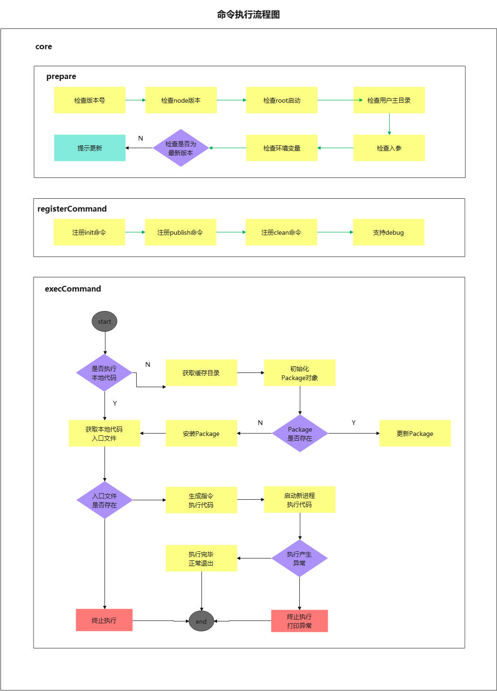

# 脚手架模块拆分策略和 core 模块

## 脚手架模块拆分策略

- 核心流程 core

- 命令 commands
  (1)初始化;
  (2)发布;

- 模型层 models
  (1) Command 命令
  (2) Project 项目
  (3) Component 组件
  (4) Npm 模块
  (5) Git 仓库

- 支撑模块 utils
  (1)Git 操作;
  (2)云构建;
  (3)工具方法;
  (4)API 请求
  (5)Git API

### 拆分原则

根据模块功能拆分

#### 核心模块 core

- core/cli
  脚手架主入口
- core/exec
  命令注册主入口

#### 命令模块 commands

- commands/init
  init 命令 继承 command 类

#### 模型模块 models

- models/command
  基础 command 类

- models/package
  基础 package 类

#### 工具模块 utils

- utils/format-path
  文件路径兼容 window 和 mac os

- utils/get-npm-info
  获取 npm 包基础信息

- utils/log
  npmlog 的二次封装

- utils/request
  axios 的二次封装

- utils/utils
  常用工具函数封装

### 命令执行流程

- 准备阶段
- 命令注册
- 命令执行

### 涉及知识点

#### 核心库

- import-local
  当我们本地 node_modules 存在一个脚手架命令，同时全局 node_modules 中也存在这个脚手架命令的时候，优先选用**本地 node_modules**中的版本
- commander
  完整的 node.js 命令行解决方案。

#### 工具库

- npmlog
  日志打印
- fs-extra
  文件操作
- semver
  版本号比对
- colors
  更改交互命令的文本颜色
- user-home
  当前用户目录
- dotenv
  是一个零依赖的模块，它能将环境变量中的变量从 .env 文件加载到 process.env 中。
- root-check
  root 账号启动检查和自动降级
