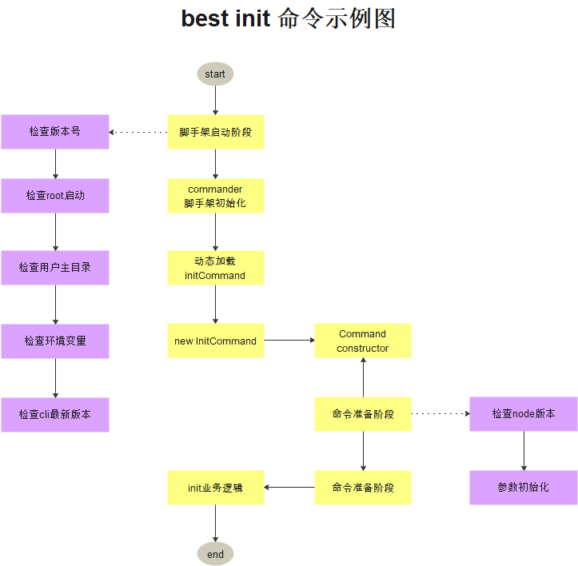

# 脚手架命令注册和执行过程开发

## 基于 Commander 完成脚手架命令注册和命令执行过程开发

## 将收获什么

- 如何设计高性能的脚手架
- Node 多进程开发
- javascript 面向对象的实战技巧

## 主要内容

- 图解高性能脚手架架构设计方法
- 封装通用的 Package 和 Command 类
- 基于缓存+Node 多进程实现动态命令加载和执行
- 将业务逻辑和脚手架框架彻底解耦

### best-cli 脚手架初始化+全局参数注册

```javascript
yarn add -D commander
```

### init 命令执行示例图


