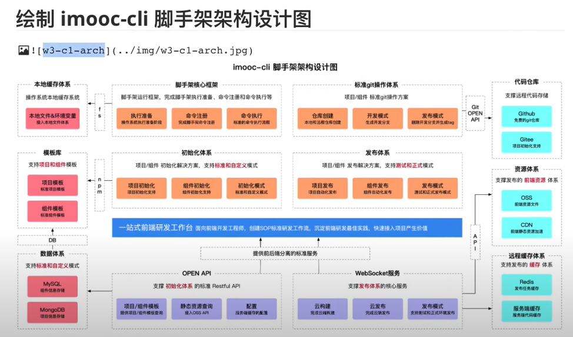

### 需求分析

- 通用的研发脚手架
- 通用的项目/组件创建能力
  (1)模板支持定制，定制后能够快速生效;
  (2)模板支持快速接入，极低的接入成本;
- 通用的项目/组件发布能力
  (1)发布过程自动完成标准的 git 操作;
  (2)发布成功后自动删除开发分支并创建 tag;
  (3)发布后自动完成云构建、OSS 上传、CDN 上传、域名绑定;
  (4)发布过程支持测试/正式两种模式;

### 大厂是如何做 git 操作的？

- (1)、从 git repository(项目仓库) fork 到 your git repository(你的远程仓库)
- (2)、从 your git repository(你的远程仓库) git clone your local git repository(本地仓库)
- (3)、在 your local git repository(本地仓库) 进行 git 操作 (git checkout / git add / git pull origin master / git push origin master)
- (4)、pull request
- (5)、创建 tags & 删除开发分支

### best-cli 脚手架架构设计图

