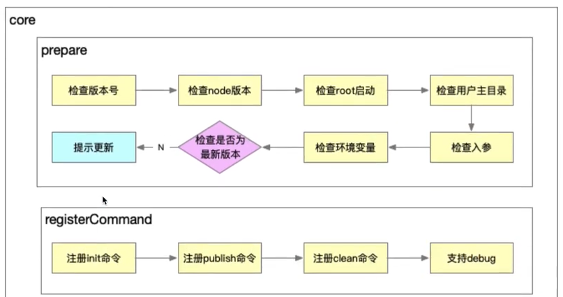
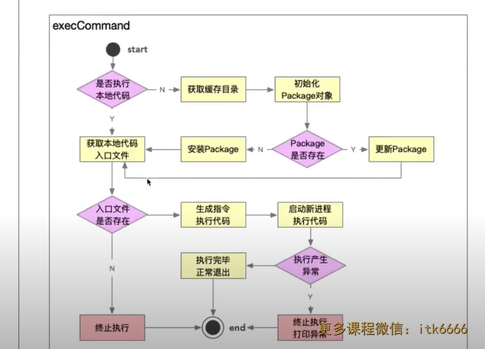

# 脚手架模块拆分策略和 core 模块

## 脚手架模块拆分策略

- 核心流程 core
- 命令 commands
  (1)初始化;
  (2)发布;
- 模型层 models
  (1) Command 命令
  (2) Project 项目
  (3) Component 组件
  (4) Npm 模块
  (5) Git 仓库

- 支撑模块 utils
  (1)Git 操作;
  (2)云构建;
  (3)工具方法;
  (4)API 请求
  (5)Git API

## core 模块技术方案

### 命令执行流程

- 准备阶段
- 命令注册
- 命令执行

### 涉及知识点

#### 核心库

- import-local
- commander

#### 工具库

- npmlog
- fs-extra
- semver
- colors
- user-home
- dotenv
- root-check
